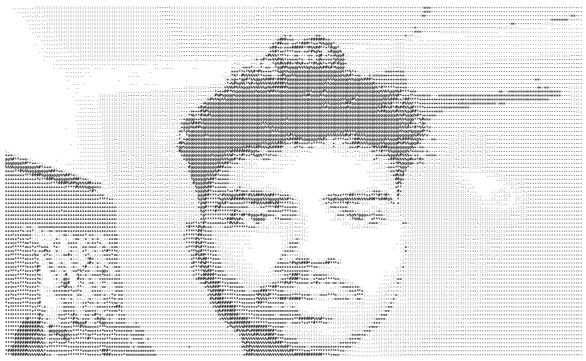

## rishavjha8515
### Rishav Anand Kumar Jha

```
─────────────────────────────────────────────────
 OS: ................ Human (Class of 2027)
 Host: ............... Kandivali East, Mumbai, India
 Kernel: ............. Physics + CS, self-compiled
 IDE: ................ VS Code (Acer Aspire, 1GB/day)

 Languages.Physics: .. Quantum Decoherence, GR, QFT
 Languages.Code: ..... Python, JS/React, LaTeX
 Interests: .......... Black Holes, Quantum Systems

 Contact
 ─────────────────────────────────────────────────
 Email ............... rishavjha8515@gmail.com
 ORCID ................ 0009-0008-4552-4154
 Research ............. zenodo.org (DOI: 10.5281/zenodo.17781173)
 Mentor ............... Dr. Adam Almakroudi, Imperial College London

 Achievement Stats
 ─────────────────────────────────────────────────
 ISEF 2026 ............ Finalist, Physics & Astronomy (Team India)
 IRO 2026 .............. Semi-Finalist
 IAAC 2026 ............. Bronze Honour, Final Round
 USAII Global AI Hack .. Finalist (Team Tribyte — HealthPath)
 AlamedaHacks 2026 ..... Top 4 of 193, international
 IdeaSprint Lab2Launch . 1st Place, IISc Bangalore
 Research Program ...... Indigo Research Scholar (1 of 15, 100% funded)
─────────────────────────────────────────────────
```

**📌 Pinned: Superposition**
> An interactive educational game adapting my ISEF / S.T. Yau research on near-extremal
> Reissner–Nordström black holes (the Meissner Gap) into 15 playable scenarios spanning
> General Relativity, quantum decoherence, and black hole thermodynamics.
> Built solo — backend simulation logic + frontend visualization.
> 🔗 superpositionalpha.vercel.app

**Also building**
- **CryptoQR** — SHA-256 + Ed25519 cryptographic document verification, Top 4/193 at AlamedaHacks
- **PhysicXports** — AI sports biomechanics platform (MediaPipe + XGBoost), live for grassroots athletes
  🔗 physicxports.vercel.app

*"From district-level science quiz to ORCID-holding researcher — one year, no shortcuts."*
```
